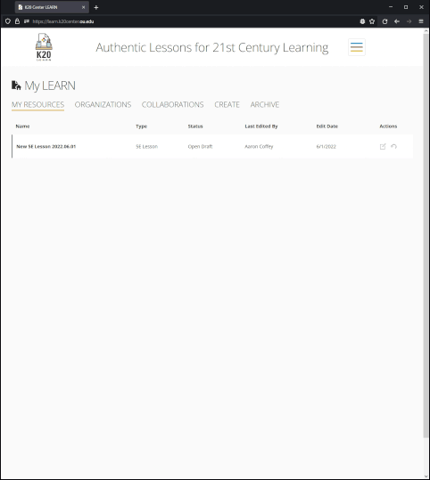

# Performance Task #2

For this task, you are asked to implement an example off-canvas menu. You can find some background information about
this kind of menu here: https://www.webfx.com/blog/web-design/off-canvas-menu. This tasks provides a mock LEARN
environment in which the menu is to be built. The project includes some source files from the live LEARN website that
are used to support the mock development environment.



## About LEARN

---

## Requirements for this menu:

### Size and position

- On larger device widths (min-width 1280px), the menu should appear on-canvas, as part of the page
- Below that threshold, the menu should be controlled with a button that opens and closes the menu
- On smaller devices, the menu may - but does not have to - occupy the entire page width
- Menu should open from the left side of the page

### Content

- The menu should show information about the current user:
    - A profile picture
    - Full name
    - Email address
    - A "Sign Out" link
- The menu should show links to major sections of the LEARN website

You may create an account on the [LEARN website](https://learn.k20center.ou.edu) and sign in to observe a similar menu
on the home page.

---

## Software you will need:

The follow specific items will be used to download the project and create a development environment:

- [Git](https://git-scm.com/)
    - Usage of Git includes:
        - Cloning the project repository.
        - Creating a personal working branch.
        - Pushing the branch back to the server upon completion.
- [Node.js](https://nodejs.org/en/)
    - Usage of Node includes:
        - Installing javascript dependencies using `npm`.
        - Running development tasks using `npm`.

Aside from Git and Node, you may use any code editor and other tools you feel necessary to complete the task.

---

## Programming languages you will use:

- [Twig](https://twig.symfony.com/) templates and HTML
    - To make setup easier, we are using a Node.js implementation of Twig
      called [Twing](https://nightlycommit.github.io/twing/).
    - Of particular use for this project,
      see [Twing for Template Designers](https://nightlycommit.github.io/twing/templates.html).
- SASS/CSS stylesheets
- Javascript

The task project is setup with limited support for including 3rd-party libraries. You are encoraged to write code by
hand whenever possible. If there are issues integrating 3rd-party libraries into the task project, it is up to you to
resolve them.

---

## Getting started

1. Ensure software tools are installed and available from the command line.
2. Open a command prompt/shell in the location you want to store the project
3. Clone the repository using `git clone https://github.com/alc/perf-task-2`.
4. Create a new branch with your first name (e.g. `git branch -b aaron`)
5. Install dependencies using `npm install`.
6. Launch the development server using `npm start`.

At this point, you should be able to navigate to http://localhost:3000 to see the task home page. It should appear
similar to the LEARN home page, but most links and buttons will not be functional. At this point you are ready to begin
development.

---

## Major tasks

Here is an example list of high-level tasks necessary to complete this project that you may follow:

1. Implement the menu structure and content using HTML and Twig
    1. Twig files are located in the `templates` folder
    2. You may add the menu in `index.html.twig` directory or in new `.twig` file(s)
2. Style the menu using SASS/CSS
    1. SASS resources are located in `assets/scss`
    2. You may create new `.scss` files or add code to the existing files
    3. Style should incorporate the current site's font and colors
    4. You **do not** need to implement a design identical to the LEARN website. We are just looking for a cohesive
       design
       that fits into the existing site
3. Implement opening and closing the menu using javascript
    1. Javascript files are located in `assets/js`
    2. A (very) brief example javascript file and dependency are provided. You may overwrite them as needed
4. Submit your project branch on [GitHub](https://github.com/) using `git push origin <your branch name>`.

---

## Implementation notes

- The content for the menu are available as Twig variables. You can see a print out of the structure of those variables
  at the bottom of the home page.
- You should render icons for each menu item using the `icon()` macro provided in `templates/macros.twig` in
  combination.
  with the provided menu items' "icon" property like this: ```{{ icon(menuItem.icon) }}```.
- The button to open and close the menu can similarly use the provided `menu-open` and `menu-closed` icons like this:
  ```{{ icon('menu-open') }}```.
- Menu items should make use of all available properties in the Twig variables. The "active" or current page should be
  styled to indicate that it is the current page
- We encourage thinking about code re-use. If you write code that seems like it could reasonably be useful elsewhere,
  consider abstracting it for that potential use.
- You may develop for modern browsers only. There is no need to address browser compatability issues.

---

## Project scoring

Each item listed below with "(## pts)" will be rated using the following scale to determine a multiplier. Each item's
total point value will be multiplied by the multiplier to determine a score, and the scores summed for a final rating.

### Multipliers

- Did not attempt - 0x multiplier
- Attempted but fails to meet expectations - 0.5x multiplier
- Meets expectations - 1x multiplier
- Exceeds expectations - 1.1x multiplier

### Graded items

- General requirements met (50 points total)
    - (14 pts) Menu includes all required content
    - (14 pts) Menu changes sizes/position/visibility correctly and the control button icon indicates whether the menu
      is open or closed
    - (14 pts) Menu style matches the surrounding LEARN environment
    - (8 pts) Project submission follows guidelines
- Code quality (50 points total)
    - Twig and HTML (10 points total)
        - (6 pts) Idiomatic usage of Twig control structures (i.e. `if/else`, `for` loops, etc.)
        - (2 pts) Valid HTML syntax is produced
        - (2 pts) No presentational markup
    - SASS/CSS (15 points total)
        - (9 pts) Clear and concise implementation
        - (3 pts) Appropriate use of variables, mixins, etc. to abstract code
        - (3 pts) Inline CSS code in HTML (if used) is explained with a comment
    - Javascript (15 points total)
        - (9 pts) Clear and concise implementation
        - (3 pts) Usage of modern techniques
        - (3 pts) No pollution of the global namespace
    - General (20 points total)
        - (10 pts) Appropriate code organization
        - (6 pts) Consistent code style
        - (4 pts) Documentation of interesting or notable decisions

### Examples
> (14 pts) Menu includes all required content

All the requested content is present, so you receive 1.0 x 14 = 14 points

> (3 pts) Inline CSS code in HTML (if used) is explained with a comment

An inline style is present with no explanation, so you receive 0.5 x 3 = 1.5 points

> (4 pts) Documentation of interesting or notable decisions

We find some confusing code and there is no documentation, so you receive 0 x 4 = 0 points

From these 3 examples, you received a total score of 15.5 points out of a possible 21. 